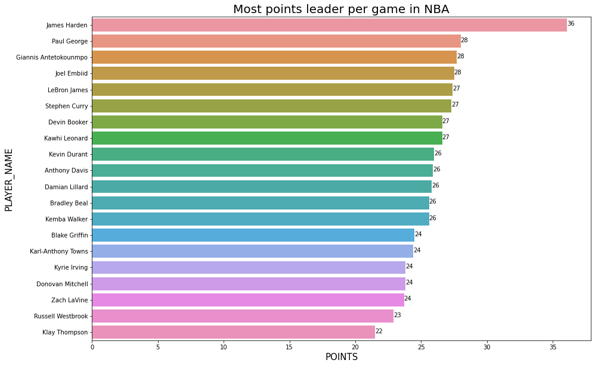

# Web-Scrapping-using-pandas-read_html

## This notebook provides a easy approach to extract data from html pages.
- The scrapping here has been done [NBA DATASET](https://www.basketball-reference.com/leagues/NBA_2019_per_game.html).
- Scrapping was done on a link that can be edited by the user i.e the particular year for which he wants the data.

##  Using pd.read_html() function to read HTML webpage
- df = pd.read_html(url, header = 0)

### Data Cleaning

- **df2019[df2019.Age == 'Age']**
 - This provides us with the data having headers present in between the dataframe.
 - We then remove this rows from the data, to get the row we are interested in.
- After cleaing the data, there are **708 records with 30 columns**
 
### Data Visualisation

- Plot shows distribution of points data by the players.
 - Maximum players have **points range between 0-15**

## Let us visualise data for the players with highest Points per game.

- Top 20 players in the league

## Let us visualise data for the players with highest Assists per game.

## Let us visualise data for the players with highest 3 Pointer per game.

- As expected we know that **Steph Curry is the best 3 point shooter in the History of NBA.**

